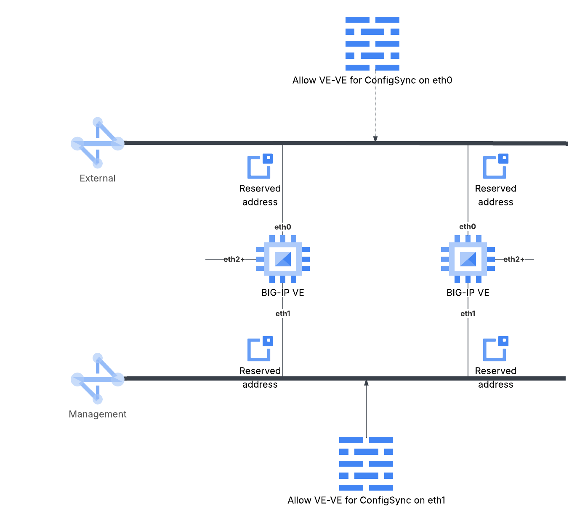

# BIG-IP HA on Google Cloud

> NOTE: This module is pre-release and functionality can change abruptly prior to v1.0 release. Be sure to pin to an
> exact version to avoid unintentional breakage due to updates.

This Terraform module creates Google Cloud infrastructure for an *opinionated, stateful, regional or zonal cluster* of
F5 BIG-IP VE instances, that are **ready to be joined as a sync group** - the actual joining of the instances
as a group relies on manual post-deployment configuration OR the use of a full declarative onboarding payload appropriate
to your scenario.

*Figure 1: The Google Cloud resources created by the module.*

> For the purpose of this module, *stateful* is taken to mean that each BIG-IP VE instance will have predetermined name,
> IP addresses, and other fixed properties, so that each instance can be aware of the names and IP addresses of*other*
> BIG-IP instances in the deployment. This simplifies the configuration that can be shared between the instances to
> create an Active-Standby (one instance handles all traffic) or Active-Active (all instances could handle traffic) HA
> deployment.
>
> The [stateless](modules/stateless) sub-module can be used to create an Active-Active HA cluster of BIG-IP VE instances
> that do not share configuration, where each instance is created and destroyed as part of a Google Cloud Managed
> Instance Group. The [stateless](modules/stateless) module can be used for *manual-scaling* and *autoscaling*
> scenarios.v

## What makes the module opinionated, and why might it be wrong for me?

You can roll your own HA deployment using F5's published [BIG-IP on Google Cloud Terraform module][upstream] module, by
deploying a set of VE instances that can be joined into a device sync group, but it has defaults for consistency with
other CSPs that can make it harder to create a group during instantiation. This module makes the following choices to
ease creation and management of a stateful HA cluster.

1. Virtual machine naming

   > OPINION: VM names should be deterministic to ease onboarding of a DSC cluster through runtime-init.

   The module provides a `num_instances` input to create between 2 and 8 instances with consistent names of the form
   *PREFIX-bigip-N*, where *PREFIX* is the value of `prefix` input variable and *N* is the one-based index of the VM in
   the cluster.

   The `instances` variable can be used to override this behavior and allow you to set the name of every instance explicitly.

2. Subnetwork and IP addressing

   > OPINION: Subnetworks used and addressing flags should be consistent on all created instances, and the cluster should
   > be *regional* or *zonal*.

   For these reasons this module exposes the input `interfaces` to define the subnetwork self-links, and public IP
   assignment flag to use for each entry in the list. These are applied to the VM in the order provided; e.g. the first
   `interfaces` entry will define the network attachment for `eth0`, the second for `eth1`, etc., through `eth7` if
   applicable. By default, the onboarding scripts will expect `eth1` to become the management (or control-plane)
   interface, so that the VM can accept traffic from a Google Cloud external load balancer. This behavior can be changed
   using the `management_interface_index` variable.

   The `instances` variable can be used to assign per-instance IP addressing.

3. Metadata - provide cluster onboarding information as instance metadata values

   > OPINION: Enable declarative onboarding for arbitrary clusters with sync group members without relying on prior
   > knowledge of primary IP addresses.

   Provisioning a fully-functional and ready to use HA cluster can be a challenge when IP addresses or names assigned to
   BIG-IP instances are not known in advance. To help in this scenario this module will add Compute Engine metadata
   entries named `big_ip_ha_peer_name`, `big_ip_ha_peer_address` to each instance which contains the BIG-IP VE name and
   primary IP address of the external interface of another instance provisioned by the module.
   `big_ip_ha_peer_owner_index` will have the fixed value *1* for the first BIG-IP VE provisioned, all others will have
   the fixed value *0*; this can be used in a Declarative Onboarding failover group definition to indicate if a BIG-IP VE
   is the initial failover group owner. A single Declarative Onboarding declaration can be used for all instances in the
   HA cluster, with the correct assignment happening at runtime.

   **NOTE:** The effective metadata value assigned to each BIG-IP VE is the result of merging the defined values above,
   the `metadata` input variable if not null or empty, and any per-instance metadata from `instances` input variable.

4. Overriding per-instance defaults

   > OPINION: Consumers of the module should be able to customize VM names, assign primary and secondary IP addresses,
   > and metadata to named instances.

   The `instances` input allows module consumers to set specific names to use for VMs, assign primary and secondary IP
   addresses, and add metadata to BIG-IP VMs on a per-instance basis. The input is a Terraform map where each key will
   be the name of an instance, and optional

   > **NOTE:** The `instances` variable has precedence over `prefix` and `num_instances`; if `instances` is provided and
   > not null or empty, a VM will be created for each key in `instances`, ignoring the value of `prefix` and
   `num_instances`.

5. Module responsibility for onboarding stops at management interface configuration and launching of runtime-init

   > OPINION: Consumers of the module must provide a runtime-init configuration to set passwords, enable data-plane, and
   > add applications, etc.

   There are simply too many configuration options and deployment scenarios to have a one-size-fits-all module suitable
   for every situation. This module will provide a cloud-init file through `user-data` metadata value that will configure
   the management interface (eth1, as determined by `management_interface_index` variable) of every instance from
   Compute Engine metadata, attempt to download and install runtime-init, then execute a provided configuration file.

   If a runtime-init configuration file is not provided the instances will not be fully configured; the admin user
   password will be unset, device sync will not be setup, etc.

<!-- markdownlint-disable no-inline-html no-bare-urls table-column-style -->
<!-- BEGIN_TF_DOCS -->
## Requirements

| Name | Version |
| ---- | ------- |
|  [terraform](#requirement\_terraform) | >= 1.5 |
|  [google](#requirement\_google) | >= 7.1 |
|  [random](#requirement\_random) | >= 3.8 |

## Modules

No modules.

## Resources

| Name | Type |
| ---- | ---- |
| [google_compute_address.dsc_control_plane](https://registry.terraform.io/providers/hashicorp/google/latest/docs/resources/compute_address) | resource |
| [google_compute_address.dsc_data_plane](https://registry.terraform.io/providers/hashicorp/google/latest/docs/resources/compute_address) | resource |
| [google_compute_firewall.data_sync](https://registry.terraform.io/providers/hashicorp/google/latest/docs/resources/compute_firewall) | resource |
| [google_compute_firewall.mgt_sync](https://registry.terraform.io/providers/hashicorp/google/latest/docs/resources/compute_firewall) | resource |
| [google_compute_instance.bigip](https://registry.terraform.io/providers/hashicorp/google/latest/docs/resources/compute_instance) | resource |
| [random_id.cluster_tag](https://registry.terraform.io/providers/hashicorp/random/latest/docs/resources/id) | resource |
| [random_shuffle.zones](https://registry.terraform.io/providers/hashicorp/random/latest/docs/resources/shuffle) | resource |
| [google_compute_image.bigip](https://registry.terraform.io/providers/hashicorp/google/latest/docs/data-sources/compute_image) | data source |
| [google_compute_subnetwork.subnets](https://registry.terraform.io/providers/hashicorp/google/latest/docs/data-sources/compute_subnetwork) | data source |
| [google_compute_zones.zones](https://registry.terraform.io/providers/hashicorp/google/latest/docs/data-sources/compute_zones) | data source |

## Inputs

| Name | Description | Type | Default | Required |
| ---- | ----------- | ---- | ------- | :------: |
|  [interfaces](#input\_interfaces) | Defines the subnetworks that will be added to the BIG-IP VE instances, and an optional flag to assign a public IP address to the interface. The first entry will become attached to eth0, the second to eth1, etc. In a standard 2+ NIC deployment on GCP it is expected that the second entry will be used for BIG-IP management interface; if you want to change this use the variable `management_interface_index` to indicate the correct zero-based interface to use. | <pre>list(object({     subnet_id = string     public_ip = optional(bool, null)     nic_type  = optional(string, null)   }))</pre> | n/a | yes |
|  [prefix](#input\_prefix) | The prefix to use when naming resources managed by this module. Must be RFC1035 compliant and between 1 and 37 characters in length, inclusive. | `string` | n/a | yes |
|  [project\_id](#input\_project\_id) | The GCP project identifier where the BIG-IP instances will be created. | `string` | n/a | yes |
|  [service\_account](#input\_service\_account) | The email address of the service account which will be used for BIG-IP instances. | `string` | n/a | yes |
|  [automatic\_restart](#input\_automatic\_restart) | Determines if the BIG-IP VMs should be automatically restarted if terminated by GCE. Defaults to true to match expected Google Compute Engine behaviour. | `bool` | `true` | no |
|  [cluster\_network\_tag](#input\_cluster\_network\_tag) | The network tag which will be unique to this cluster of BIG-IP instances to enable sync-group Firewall rules, and can also be used in CFE declarations. If left blank (default), a random value will be generated.  NOTE: The final set of tags applied to instances will be the union of `cluster_network_tag` and `network_tags`. | `string` | `null` | no |
|  [description](#input\_description) | An optional description to add to the BIG-IP Instances created from the module. If null/empty (default), a description will be generated. | `string` | `null` | no |
|  [disk\_size\_gb](#input\_disk\_size\_gb) | Use this flag to set the boot volume size in GB. If left at the default value the boot disk will have the same size as the base image. | `number` | `null` | no |
|  [disk\_type](#input\_disk\_type) | The boot disk type to use with instances; can be 'pd-balanced', 'pd-ssd' (default), or 'pd-standard'. | `string` | `"pd-ssd"` | no |
|  [host\_domain](#input\_host\_domain) | Defines the common DNS domain name to append to each BIG-IP instance's name to set the Compute Engine hostname value. If null or empty (default), the Compute Engine hostname will not be specified and default Compute Engine hostname assignment will occur. NOTE: This can also be set or overridden on a per-instance basis using the `instances` variable. | `string` | `null` | no |
|  [image](#input\_image) | The self-link URI for a BIG-IP image to use as a base for the VM cluster. This can be an official F5 image from GCP Marketplace, or a customised image. The default value is the latest BIG-IP v21 PAYG Good 10gbps image as of module publishing. | `string` | `"projects/f5-7626-networks-public/global/images/f5-bigip-21-0-0-1-0-0-13-payg-good-10gbps-260128095822"` | no |
|  [instances](#input\_instances) | An optional map of instances names that will be used to override num\_instances and common parameters. When creating BIG-IP instances the names will correspond to the keys in `instances` variable, and each instance named will receive the hostname, primary and/or Alias IPs associated with the instance. | <pre>map(object({     hostname = optional(string)     metadata = optional(map(string))     interfaces = optional(list(object({       primary_ip = optional(string)       secondary_ips = optional(list(object({         cidr       = string         range_name = optional(string)       })))     })))   }))</pre> | `null` | no |
|  [labels](#input\_labels) | An optional map of string key:value pairs that will be applied to all resources created that accept labels, overriding the value present in the Instance Template. Default is null. | `map(string)` | `null` | no |
|  [machine\_type](#input\_machine\_type) | The machine type to use for BIG-IP VMs; this may be a standard GCE machine type, or a customised VM ('custom-VCPUS-MEM\_IN\_MB'). Default value is 'n1-standard-8'. \_NOTE:\_ machine\_type is highly-correlated with network bandwidth and performance; an N2 machine type will give better performance but has limited regional availability. | `string` | `"n1-standard-8"` | no |
|  [management\_interface\_index](#input\_management\_interface\_index) | Defines the zero-based index of the network interface that will be used exclusively for BIG-IP management interface on multi-nic deployments. The default value is 1, which will configure the BIG-IP during first boot to use eth1 for management interface and auto-configure it appropriately. | `number` | `1` | no |
|  [metadata](#input\_metadata) | An optional map of strings containing Compute Engine metadata values for BIG-IP instances that will be created from this module. | `map(string)` | `null` | no |
|  [min\_cpu\_platform](#input\_min\_cpu\_platform) | An optional constraint used when scheduling the BIG-IP VMs; this value prevents the VMs from being scheduled on hardware that doesn't meet the minimum CPU micro-architecture. Default value is null. | `string` | `null` | no |
|  [network\_tags](#input\_network\_tags) | An optional set of network tags which will be added to the BIG-IP VMs, typically used to associate VMs with Cloud NAT and firewall rules. | `list(string)` | `null` | no |
|  [num\_instances](#input\_num\_instances) | The number of BIG-IP instances to create as an HA group. Default value is 2. | `number` | `2` | no |
|  [preemptible](#input\_preemptible) | If set to true, the BIG-IP instances will be deployed on preemptible VMs, which could be terminated at any time, and have a maximum lifetime of 24 hours. Default value is false. DO NOT SET TO TRUE UNLESS YOU UNDERSTAND THE RAMIFICATIONS! | `bool` | `false` | no |
|  [runtime\_init\_config](#input\_runtime\_init\_config) | A runtime-init JSON or YAML configuration that will be executed during initialisation. If omitted, the BIG-IP instances will be largely unconfigured, with only the management interface accessible. | `string` | `"controls:\n    logLevel: info\npost_onboard_enabled:\n  - name: save_config\n    type: inline\n    commands:\n      - tmsh save sys config\n"` | no |
|  [runtime\_init\_installer](#input\_runtime\_init\_installer) | Defines the location of the runtime-init package to install, and an optional SHA256 checksum. During initialisation, the runtime-init installer will be downloaded from this location - which can be an http/https/gs/file/ftp URL - and verified against the provided checksum, if provided. Additional flags can change the behaviour of runtime-init when used in restricted environments (see https://github.com/F5Networks/f5-bigip-runtime-init?tab=readme-ov-file#private-environments). | <pre>object({     url                          = optional(string, "https://github.com/F5Networks/f5-bigip-runtime-init/releases/download/2.0.3/f5-bigip-runtime-init-2.0.3-1.gz.run")     sha256sum                    = optional(string, "e38fabfee268d6b965a7c801ead7a5708e5766e349cfa6a19dd3add52018549a")     skip_telemetry               = optional(bool, false)     skip_toolchain_metadata_sync = optional(bool, false)     skip_verify                  = optional(bool, false)     verify_gpg_key_url           = optional(string, null)   })</pre> | `{}` | no |
|  [zones](#input\_zones) | An optional list of Compute Engine Zone names where where the BIG-IP instances will be deployed; if null or empty (default), BIG-IP instances will be randomly distributed to known zones in the subnetwork region. If one or more zone is given, the BIG-IP instances will be constrained to the zones specified. | `list(string)` | `null` | no |

## Outputs

| Name | Description |
| ---- | ----------- |
|  [cluster\_tag](#output\_cluster\_tag) | The network tag generated to uniquely identify the instances in this HA cluster. |
|  [instances\_by\_zone](#output\_instances\_by\_zone) | A map of Compute Engine zones to a list of instance self-links. |
|  [names](#output\_names) | The instance names of the BIG-IPs. |
|  [private\_mgmt\_ips](#output\_private\_mgmt\_ips) | A map of BIG-IP instance name to private IP address on the management interface. |
|  [public\_mgmt\_ips](#output\_public\_mgmt\_ips) | A map of BIG-IP instance name to public IP address, if any, on the management interface. |
|  [self\_links](#output\_self\_links) | A map of BIG-IP instance name to fully-qualified self-links. |
<!-- END_TF_DOCS -->
<!-- markdownlint-enable no-inline-html no-bare-urls table-column-style -->

[upstream]: https://registry.terraform.io/modules/F5Networks/bigip-module/gcp/latest
