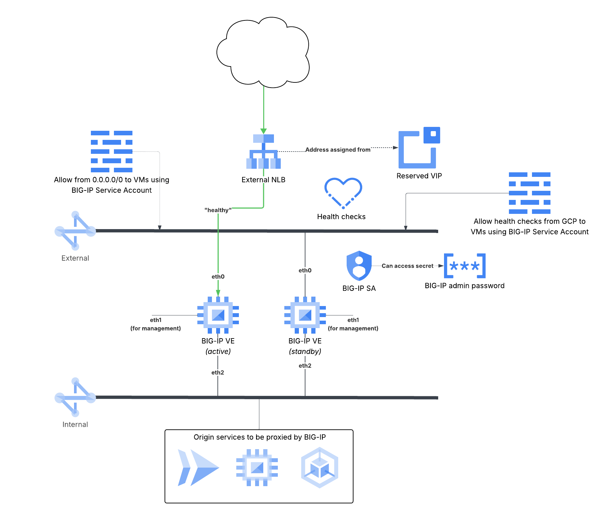

# Bring your own license, stateful, active-standby BIG-IP HA with Public IP (VIP) via NLB

This directory contains an example deployment of BIG-IP VEs in an active-standby stateful cluster, with public IP
address disaggregation provided by a passthrough External Network Load Balancer. Essentially this is the same as the
[stateful-nlb](../stateful-nlb/) example, but with BYOL images and explicit license keys.

The characteristics of this deployment
are:

* BIG-IP VEs are created and destroyed by Terraform/Tofu, not by Google
  * BIG-IP VEs do NOT need to prove they are alive
  * BIG-IP VEs rely on consistent naming and addressing for synchronization between VE instances
* The public IP address is assigned to an NLB, which sends traffic unchanged to BIG-IP VE instances
  * NLB selects the active BIG-IP VE to receive the connection based on NLB health check responses


*Figure 1: The resources created by this example.*

## Prerequisites

* Two BIG-IP license keys (aka regKeys) to apply to VE instances
* Existing VPC subnetworks that can be attached to BIG-IP VE external data-plane interface (`eth0`),
  management/control-plane interface (`eth1`), and internal data-plane interface (`eth2`)
* An HTTP backend that is routable from the internal interface (`eth2`) and will be the origin for the deployment

## Quick Usage

1. Clone the example from GitHub

   ```shell
   terraform init --from-module git::https://github.com/f5devcentral/terraform-google-f5-bigip-ha//examples/stateful-nlb
   ```

1. Create `terraform.tfvars`, or use fixed values in [main.tf](./main.tf)

   Add the required values at a minimum, referencing the prerequisites from above. E.g.

   ```hcl
   name            = "bigip-nlb"
   project_id      = "my-gcp-project"
   region          = "us-central1"
   interfaces      = [
      {
         subnet_id = "projects/my-gcp-project/regions/us-central1/subnetworks/external"
      },
      {
         subnet_id = "projects/my-gcp-project/regions/us-central1/subnetworks/management"
      },
      {
         subnet_id = "projects/my-gcp-project/regions/us-central1/subnetworks/internal"
      },
   ]
   allowlist_cidrs = [
      "a.b.c.d/xx",
   ]
   license_keys    = [
      "big-ip-reg-key-1",
      "big-ip-reg-key-2"
   ]
   ```

1. Provision the BIG-IP VE HA cluster

   1. Preview the changes that Terraform will make to your environment

   ```shell
   terraform plan
   ```

   Address any errors, warnings or changes.

   1. Provision resources

   ```shell
   terraform apply
   ```

1. Tear down resources after testing

   ```shell
   terraform destroy
   ```

## Suggested next steps

1. Use the [runtime-init-conf](./templates/runtime-init-conf.yaml) YAML template as a basis for a custom deployment
   that onboards the BIG-IP VEs the way you need for your environment
1. Add SSH keys to [runtime-init-conf](./templates/runtime-init-conf.yaml) to explicitly assign to admin user, or use
   instance (or project) metadata to add SSH public keys that are retrieved during onboarding
1. Modify Instance Template parameters to change Compute Engine machine-type, disk size, etc.
1. Move [VIP address reservation](./main.tf#L27-39) to another module
1. Move the [BIG-IP admin user password management](./main.tf#L55-96) to another module
1. Move the [BIG-IP VE service account](./main.tf#L41-53) to another module

The last three are considered best practices for production deployment since it removes critical infrastructure from the
lifecycle of the BIG-IP VEs deployed by the module. This can help limit the "blast radius" of unintentional destructive
actions during day 2+ operations. For example, the reserved IP address is often a published resource and assigned to
DNS records; an errant `terraform destroy` could irreversibly destroy the IP address reservation if Google reassigns
ownership.

<!-- markdownlint-disable no-inline-html no-bare-urls table-column-style -->
<!-- BEGIN_TF_DOCS -->
## Requirements

| Name | Version |
|------|---------|
| <a name="requirement_terraform"></a> [terraform](#requirement\_terraform) | >= 1.5 |
| <a name="requirement_google"></a> [google](#requirement\_google) | >= 7.1 |
| <a name="requirement_random"></a> [random](#requirement\_random) | >= 3.8 |

## Modules

| Name | Source | Version |
|------|--------|---------|
| <a name="module_admin_password"></a> [admin\_password](#module\_admin\_password) | memes/secret-manager/google | 2.2.2 |
| <a name="module_bigip_ha"></a> [bigip\_ha](#module\_bigip\_ha) | git::https://github.com/f5devcentral/terraform-google-f5-bigip-ha | v0.2.2 |

## Resources

| Name | Type |
|------|------|
| [google_compute_address.vip](https://registry.terraform.io/providers/hashicorp/google/latest/docs/resources/compute_address) | resource |
| [google_compute_firewall.public](https://registry.terraform.io/providers/hashicorp/google/latest/docs/resources/compute_firewall) | resource |
| [google_compute_firewall.readyz](https://registry.terraform.io/providers/hashicorp/google/latest/docs/resources/compute_firewall) | resource |
| [google_compute_forwarding_rule.vip](https://registry.terraform.io/providers/hashicorp/google/latest/docs/resources/compute_forwarding_rule) | resource |
| [google_compute_http_health_check.readyz](https://registry.terraform.io/providers/hashicorp/google/latest/docs/resources/compute_http_health_check) | resource |
| [google_compute_target_pool.bigip](https://registry.terraform.io/providers/hashicorp/google/latest/docs/resources/compute_target_pool) | resource |
| [google_secret_manager_secret_version.admin_password](https://registry.terraform.io/providers/hashicorp/google/latest/docs/resources/secret_manager_secret_version) | resource |
| [google_service_account.sa](https://registry.terraform.io/providers/hashicorp/google/latest/docs/resources/service_account) | resource |
| [random_string.admin_password](https://registry.terraform.io/providers/hashicorp/random/latest/docs/resources/string) | resource |
| [google_compute_subnetwork.external](https://registry.terraform.io/providers/hashicorp/google/latest/docs/data-sources/compute_subnetwork) | data source |

## Inputs

| Name | Description | Type | Default | Required |
|------|-------------|------|---------|:--------:|
| <a name="input_interfaces"></a> [interfaces](#input\_interfaces) | Defines the subnetworks that will be added to the instance template, and an optional flag to assign a public IP<br/>address to the interface. The first entry will become attached to eth0, the second to eth1, etc. See module README for<br/>more details. | <pre>list(object({<br/>    subnet_id = string<br/>    public_ip = optional(bool, null)<br/>    nic_type  = optional(string, null)<br/>  }))</pre> | n/a | yes |
| <a name="input_license_keys"></a> [license\_keys](#input\_license\_keys) | The pair of F5 BIG-IP license keys to assign to the instances. | `list(string)` | n/a | yes |
| <a name="input_name"></a> [name](#input\_name) | The name (and prefix) to use when naming resources managed by this module. Must be RFC1035<br/>compliant and between 1 and 37 characters in length, inclusive. | `string` | n/a | yes |
| <a name="input_project_id"></a> [project\_id](#input\_project\_id) | The Google Cloud project identifier where the stateless BIG-IP HA cluster and supporting resources will be deployed. | `string` | n/a | yes |
| <a name="input_region"></a> [region](#input\_region) | The Compute Engine regions in which to create the example application and VPCs. Default is `us-central1`. | `string` | n/a | yes |
| <a name="input_allowlist_cidrs"></a> [allowlist\_cidrs](#input\_allowlist\_cidrs) | An optional list of CIDRs to be permitted access to BIG-IP instances via public VIP. Default is ["0.0.0.0/0"]. | `list(string)` | <pre>[<br/>  "0.0.0.0/0"<br/>]</pre> | no |
| <a name="input_labels"></a> [labels](#input\_labels) | An optional map of string key:value pairs that will be applied to all resources created that accept labels, overriding<br/>the value present in the Instance Template. Default is null. | `map(string)` | `null` | no |
| <a name="input_metadata"></a> [metadata](#input\_metadata) | An optional map of metadata strings to add to all BIG-IP instances. | `map(string)` | `null` | no |

## Outputs

| Name | Description |
|------|-------------|
| <a name="output_admin_password_secret_id"></a> [admin\_password\_secret\_id](#output\_admin\_password\_secret\_id) | n/a |
| <a name="output_self_links"></a> [self\_links](#output\_self\_links) | n/a |
| <a name="output_vip"></a> [vip](#output\_vip) | The public VIP for backend service. |
<!-- END_TF_DOCS -->
<!-- markdownlint-enable no-inline-html no-bare-urls table-column-style -->
